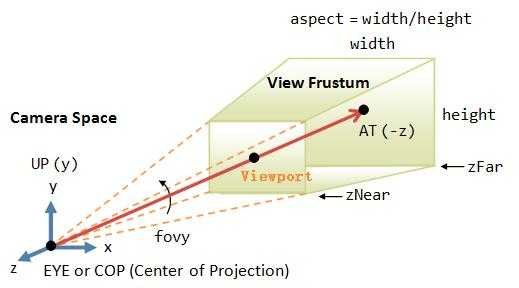
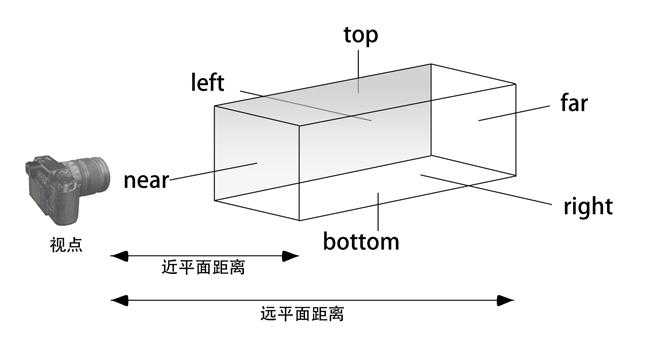
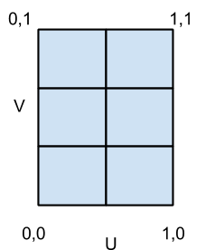

## 基于WebGL的三维渲染框架 Three.JS    
### 一、基本概念
+ 场景（Scene）：放置三维物体的容器。    
+ 相机（Camera）：设置观察者的位置和观察角度。    
+ 渲染器（Renderer）：根据场景和相机的设置，执行渲染工作。    
+ 三维物体（Object3D）：由几何形状和表面材质来确定一个三维物体。    
+ 画布（Canvas）：最终用于显示画面的 Html 元素。    
+ 光源（Light）：在三维场景中提供光照。

> 将以上概念中的场景和相机与真实的电影拍摄类比，三维物体可以理解为演员。通过这些基本元素，可以唯一确定需要渲染出来的画面。    

### 二、相机分类    
+ 正交投影相机（OrthographicCamera）：物体大小不因远近而变化。     
+ 透视投影相机（PerspectiveCamera）：遵循近大远小的空间规则。    

  #### 1. 透视投影相机
    
　
  #### 2. 正交投影相机
    

### 三、三维物体 = 几何形状 + 表面材质
+ 几何形状（Geometry）：包含三维物体的顶点数据，面片数据，UV坐标，法向量等。    
+ 表面材质（Material）：设置三维物体表面的颜色，图片，光照效果等。    

  > MeshBasicMaterial：对光照无感，给几何体一种简单的颜色或显示线框。
  > MeshLambertMaterial：这种材质对光照有反应，用于创建暗淡的不发光的物体。
  > MeshPhongMaterial：这种材质对光照也有反应，用于创建金属类明亮的物体。

### 四、纹理贴图
+ UV映射
  
> 在三维物体上贴图，可以通过UV映射的方式来实现。可以理解为将三维对象展开成一个平面，然后将图片贴在展开的平面上，最后将展开的平面恢复成三维对象。**实际上是建立了三维几何体与二维平面图的映射关系。**

**附录：UV平面坐标系**


### 五、透明三维对象的叠加显示    
+ 只有三维对象可透视（translate）时，才需要处理多个对象的叠加显示效果。    

**常用叠加效果：**
> NoBlending：重叠三维物体颜色不做混合。
> NormalBlending：根据法向量与rgb值运算后进行混合。
> AdditiveBlending：rgb值按比例相加进行混合。
> SubtractiveBlending：rgb值按比例做差进行混合。
> MultiplyBlending：rgb值按比例做乘积进行混合。
> CustomBlending：自定义混合系数。


```
注：可参考three.js/example中的demo帮助理解
1. camera：正交投影与透视投影。
2. geometries：内置的几何体展示。
3. geometry/cube：立方体贴图，绘制木箱的三维模型。
4. geometry/normals：展示几何体的法向量信息。
5. lights/physical：光照效果。
6. light/spotlight：不同材质的光照效果。
7. materials/blending：颜色叠加效果。
```
